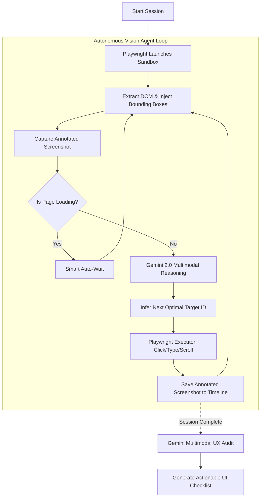

<div align="center">
  <h1>⚡ UX-Ray</h1>
  <p><strong>Autonomous AI QA Agent & User Testing Simulator</strong></p>

  <p>
    <a href="https://nextjs.org/"></a>
    <a href="https://playwright.dev/"></a>
    <a href="https://playwright.dev/"></a>
    <a href="https://deepmind.google/technologies/gemini/"></a>
  </p>
</div>

<br/>

**UX-Ray** is an autonomous AI agent designed for startups and indie builders. It acts as a simulation of 1,000 real first-time users, intelligently navigating your web application to identify UX friction, discover behavior patterns, and generate developer-ready actionable checklists before you launch.

## 📋 Table of Contents
- [✨ Core Features](#-core-features)
- [🏗️ System Architecture](#-system-architecture)
- [💻 Tech Stack](#-tech-stack)
- [⚙️ Environment Variables Reference](#️-environment-variables-reference)
- [🚀 Local Installation](#-local-installation)
- [🕹️ Usage Guide](#️-usage-guide)
- [📜 License](#-license)

---

## ✨ Core Features

- 🧠 **Senior QA Algorithmic Explorer:** UX-Ray is prompted with strict algorithmic rules. It deduces visual hierarchy based on button sizes (width/height), explicitly tests edge cases, and maps out core workflows without getting stuck in loops.
- 👁️ **Spatial & Semantic Awareness:** The internal Playwright engine extracts rich DOM metadata including `width`, `height`, `disabled` states, `aria-labels`, and `hrefs`. This gives the AI true "sight" of your app.
- ⏳ **Smart Auto-Wait Engine:** Built directly into the execution engine, the AI automatically detects active spinners or loading text and waits for your app to finish loading before proceeding. This mimics true human patience.
- 🛠️ **Heuristic UI Evaluation:** The AI acts as a Senior UX/UI Engineer, grading your app against Nielsen's 10 Usability Heuristics. It outputs exact, developer-ready CSS and layout fixes (e.g., *"Increase the contrast ratio from #555 to #333"*).
- 🎥 **Live Session Replay:** Watch the AI test your app in real-time, complete with a timeline of events, network interactions, and AI "thoughts".

---

## 🏗️ System Architecture

UX-Ray operates on a continuous, multi-modal autonomous loop using **Set-of-Mark Visual Prompting**.



### AI Pipeline Details
1. **Set-of-Mark Annotation:** Before making a decision, the headless browser dynamically injects red numeric bounding boxes over every interactable element on the screen.
2. **Visual Autonomous Navigation:** The agent streams the live, annotated screenshot directly to **Gemini 2.0 Flash**. The AI uses spatial reasoning to "look" at the screen, read the popups, and output the ID of the exact bounding box it wants to interact with.
3. **Actionable UX Audit:** Uses the captured visual timeline to write a highly technical, bias-free UI/UX report.

---

## 💻 Tech Stack

| Component | Technology | Description |
| :--- | :--- | :--- |
| **Framework** | **Next.js 14** | App Router, API Routes for SSE streaming |
| **Database** | **PostgreSQL** | Managed via Prisma ORM for session/event storage |
| **Automation** | **Playwright** | Headless browser execution and visual DOM annotation |
| **Reasoning** | **Gemini 2.0 Flash**| Powers the deep visual navigation and decision logic |
| **Reporting** | **Gemini Pro**| Multimodal visual analysis for the final UX Audit report |
| **Styling** | **Tailwind CSS** | Custom highly-polished developer interface |

---

## ⚙️ Environment Variables Reference

Create a `.env` file in the root directory.

| Variable | Required | Description |
| :--- | :---: | :--- |
| `DATABASE_URL` | Yes | Connection string for your PostgreSQL database (e.g., Supabase) |
| `DIRECT_URL` | Yes | Direct connection string for Prisma migrations |
| `GEMINI_API_KEY` | Yes | API key from Google AI Studio for visual reasoning and reporting |

---

## 🚀 Local Installation

1. **Clone the repository**
   ```bash
   git clone https://github.com/yourusername/ux-ray.git
   cd ux-ray
   ```

2. **Install dependencies**
   ```bash
   npm install
   ```

3. **Initialize Database**
   ```bash
   npx prisma generate
   npx prisma db push
   ```

4. **Run the Development Server**
   ```bash
   npm run dev
   ```
   Open [http://localhost:3000](http://localhost:3000) to access the dashboard.

---

## 🕹️ Usage Guide

1. Enter your target URL in the main dashboard.
2. Select your personalized Developer Testing Preset (e.g., **End-to-End Journey**, **Aggressive QA Tester**, or **Conversion Flow**).
3. Watch the live **Session Explorer** as the AI isolates your site in a sandbox, reads the spatial layout, and systematically tests buttons, forms, and workflows.
4. Click **Share report to team** to distribute the actionable UX Audit directly to your engineers.

---

## 📜 License

This project is licensed under the MIT License - see the [LICENSE](LICENSE) file for details.
